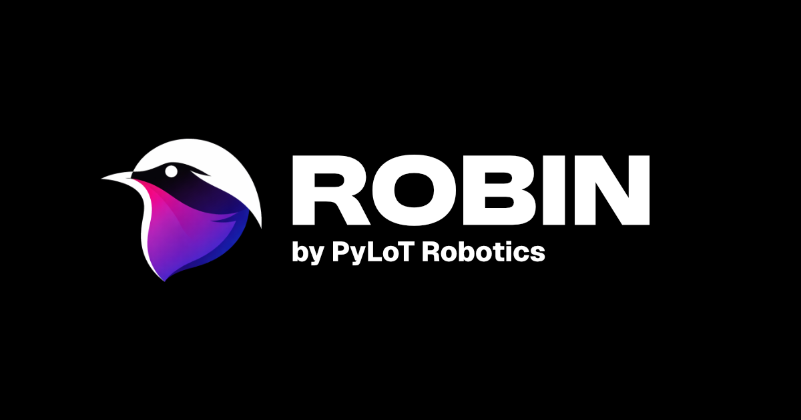

# Robin

[PyLoT Robotics](https://pylot.kaijo-physics.club)で制作しているロボットのデバッグ用コントローラーです。

# セットアップ
このREADMEを内包しているフォルダで、
```bash
sh gists/setup.sh
```
を実行すればあとは指示に従えばいいです

# 証明書のインストール
スマホに証明書をインストールしなければパソコンで起動したclientにアクセスした際にブラウザに警告が表示されます。
```bash
sh gist/transferRootCA.sh
```
で表示されたQRコードにアクセスするとrootCA.pemをダウンロードすることができます。

## iPhoneの場合
https://zenn.dev/takumiabe21/articles/645a38c0c18389 の「○iPhoneのSafariからHTTPS接続する。」以降を参考にインストールしてください。

## Androidの場合
また今度書きます、、

# 起動する
```bash
#Topicの送受信に必要なRosbrdige_serverの起動
ros2 launch rosbridge_server rosbridge_websocket_launch.xml

#Video Publisherの起動
source install/setup.bash
ros2 run robin video_publisher

#プロキシサーバーの起動
cd src/robin/server
bun run serve
```
# (optional)クライアントの起動
```bash
colcon build
source install/setup.bash
ros2 run robin client
```
(2秒以内くらいにQRコードがでれば成功です、でなければ何かがうまく行ってないので`sh gist/setup.sh`をしてください)
映像送信用のVideo_publisherの起動

# 特定TopicをLeRobot形式で保存する
以下で任意のTopicを購読し、LeRobot形式の最小構成で保存できます。
```bash
source install/setup.bash
ros2 run robin lerobot_recorder --ros-args \
  -p topic_name:=/joint_states \
  -p output_dir:=./lerobot_dataset \
  -p task_name:=teleop \
  -p episode_index:=0
```

設定受信用Topic（既定: `/lerobot_recorder/config`）を変える場合は以下です。

```bash
ros2 run robin lerobot_recorder --ros-args \
  -p control_topic_name:=/my/lerobot/config
```

Topic型が自動検出できない場合は、`message_type` を明示してください。

```bash
ros2 run robin lerobot_recorder --ros-args \
  -p topic_name:=/my_topic \
  -p message_type:=std_msgs/msg/String
```

実行中に、保存対象Topic一覧を `std_msgs/String` で送ると購読対象を切り替えできます。

JSON配列を送る例:

```bash
ros2 topic pub --once /lerobot_recorder/config std_msgs/msg/String \
  "{data: '[\"/joint_states\",\"/imu/data\"]'}"
```

カンマ区切り文字列でも送れます:

```bash
ros2 topic pub --once /lerobot_recorder/config std_msgs/msg/String \
  "{data: '/joint_states,/imu/data'}"
```

保存先を実行中に変える場合は、JSONオブジェクトで `output_dir` を渡します。

```bash
ros2 topic pub --once /lerobot_recorder/config std_msgs/msg/String \
  "{data: '{\"topics\":[\"/joint_states\"],\"output_dir\":\"./lerobot_dataset/session2\"}'}"
```

出力先には以下が生成されます。
- `meta/info.json`
- `meta/tasks.jsonl`
- `meta/episodes.jsonl`
- `data/chunk-000/episode_000000.parquet`